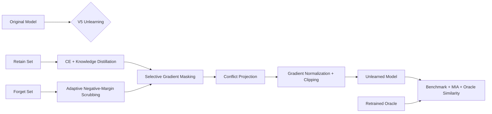

# 🛡️ Privacy-Preserving Machine Unlearning

<p align="center">
  <b>Retain-protected machine unlearning with selective gradient scrubbing, oracle evaluation, and privacy testing.</b>
</p>

<p align="center">
  
  
  
  
  
</p>

<p align="center">
  <a href="https://github.com/Unknowncoder3/privacy-preserving-machine-unlearning">Repository</a> ·
  <a href="https://github.com/Unknowncoder3/privacy-preserving-machine-unlearning/tree/improve/projected-forgetting">Experimental Branch</a>
</p>

---

## 🚀 Project at a glance

Machine learning models can retain information from training data long after that data should be removed. **Machine unlearning** studies how to remove the influence of selected training samples without retraining the entire model from scratch.

This project builds a complete, reproducible **PyTorch + MNIST** benchmark for that problem:

- deterministic **retain / forget** dataset splitting
- original-model and retrained-oracle baselines
- a **V5 retain-protected gradient unlearning** method
- confidence-based **membership inference attack (MIA)** evaluation
- direct behavioral comparison against the retrained oracle
- automated tests and GitHub Actions CI
- laptop-friendly experiments using **Apple MPS**

> **Research question:** Can selected training samples be forgotten while preserving retained utility and reducing observable privacy leakage at a lower cost than full retraining?

---

## 📊 Key results

The final V5 experiment used a deterministic **10% forget split**: 6,000 forget samples and 54,000 retain samples.

| Metric | V5 Result |
|---|---:|
| 🎯 Retain accuracy | **98.56%** |
| 🧪 Test accuracy | **98.22%** |
| 🔐 Forget-set mean confidence | **96.69%** |
| 🕵️ Confidence-MIA ROC-AUC | **0.4934** |
| ✅ Automated tests | **6 / 6 passing** |

### Why these numbers matter

- **Utility stayed high:** the model retained 98.56% accuracy on the retained training data.
- **Generalization stayed stable:** test accuracy remained 98.22%.
- **MIA was near random:** an ROC-AUC of 0.4934 is close to the 0.50 random-guess baseline.
- **No privacy overclaim:** these results do **not** constitute a formal privacy guarantee or proof of complete unlearning.

---

## 💡 Why I built this

This project combines several areas that matter in practical ML engineering:

**Machine Learning** → model training, loss design, knowledge distillation  
**Privacy** → membership inference and data-removal evaluation  
**Research Engineering** → controlled experiments, ablations, reproducibility  
**Software Engineering** → modular Python code, CLI workflows, tests, CI

The goal is not just to train a model—it is to build an **inspectable experimental pipeline** where an unlearning method can be trained, measured, compared, and reproduced.

---

## 🧠 What I built

### 1. Deterministic local benchmark

A raw IDX MNIST loader keeps the experiment fully local and reproducible.

- 60,000 original training samples
- 54,000 retain samples
- 6,000 forget samples
- 10,000 test samples
- deterministic split seed: **42**
- split indices saved to `artifacts/split_manifest.json`

The dataset itself is intentionally excluded from Git.

### 2. Three-model evaluation setup

| Model | Purpose |
|---|---|
| **Original** | Trained using the complete training set |
| **Retrained oracle** | Trained from scratch after removing the forget set |
| **V5 unlearned** | Starts from the original model and selectively removes forget-set influence |

The retrained model acts as a **practical behavioral oracle**, not a mathematical proof of what the unlearned model must look like.

### 3. V5 retain-protected unlearning

The final method combines:

- adaptive negative-margin scrubbing on forget samples
- selective gradient masking
- retain-set supervised learning
- knowledge distillation from the original model
- conflict projection between forget and retain gradients
- gradient normalization
- gradient clipping

This makes the forgetting process explicit at the gradient level rather than treating unlearning as ordinary fine-tuning.

---

## 🔬 How V5 works



### Forget objective

For each forget sample:

```text
margin = true_class_logit - strongest_competitor_logit
```

The final V5 target is:

```text
target margin = -0.5
```

The objective remains active while the true-class margin is above that target. In the final run, the measured margin remained strongly positive, meaning the scrubbing objective was still active rather than artificially reported as complete.

---

## 🧪 Final benchmark

| Metric | Original | Retrained Oracle | V5 Unlearned |
|---|---:|---:|---:|
| Retain accuracy | 98.513% | 98.452% | **98.565%** |
| Forget accuracy | 98.567% | 97.983% | 98.583% |
| Test accuracy | 98.200% | 98.090% | **98.220%** |
| Forget confidence | 96.869% | 96.514% | **96.692%** |
| Confidence-MIA ROC-AUC | 0.4955 | 0.4952 | **0.4934** |

### Oracle similarity on the forget set

| Metric | V5 vs Retrained | V5 vs Original |
|---|---:|---:|
| Prediction agreement | 99.15% | **99.83%** |
| Jensen-Shannon divergence | 0.001226 | **0.000135** |
| Probability MAE | 0.002301 | **0.000751** |
| Logit cosine similarity | 0.99633 | **0.99942** |

### What the similarity tells us

The V5 model preserves the original model's behavior extremely well, which is positive for utility—but it also means its forget-set behavior is **still substantially closer to the original than to the retrained oracle**.

That is an important research finding.

> **Conclusion:** V5 is a strong, stable engineering baseline with excellent utility preservation and near-random confidence-MIA performance, but it should be described as **partial/observable forgetting**, not as proof of complete machine unlearning.

---

## 📈 Method evolution

The project deliberately evolved through controlled experiments instead of changing everything at once.

| Version | Main idea | Result |
|---|---|---|
| **V1** | Bounded uniform forgetting + selective gradient masking | Stable baseline |
| **V2** | Added retain-protected conflict projection | Small directional improvement |
| **V3** | Bounded CE-based forgetting | More aggressive objective, limited oracle movement |
| **V4** | Margin scrubbing | Better-controlled forgetting objective |
| **V5** | Negative-margin target + projection + diagnostics | **Final stable method** |

**V5 is the final experimental version in this branch.**

---

## 🔐 Privacy evaluation

The project includes a confidence-based black-box membership inference attack.

The attack asks whether a model's confidence can distinguish training members from non-members.

A useful result should move attack performance toward random guessing:

```text
Random baseline ≈ 0.50 ROC-AUC
V5 result      = 0.4934 ROC-AUC
```

However:

> **MIA is an evaluation signal, not a formal privacy guarantee.**

A low attack score alone cannot prove that training influence has been completely removed.

---

## 🧪 Testing & reproducibility

The repository includes automated pipeline tests covering the core dataset/model workflow.

Current status:

```text
6 passed in 0.87s
```

Run locally with:

```bash
KMP_DUPLICATE_LIB_OK=TRUE PYTHONPATH=. pytest -q
```

The repository also includes GitHub Actions CI for automated testing.

### Reproducibility features

- fixed random seed: **42**
- deterministic retain/forget split
- saved split manifest
- configuration-driven experiments
- generated checkpoints and results kept outside Git
- local MNIST dataset, so no external dataset download is required by the experiment

---

## ⚡ Quick start

### 1. Clone and install

```bash
git clone https://github.com/Unknowncoder3/privacy-preserving-machine-unlearning.git
cd privacy-preserving-machine-unlearning

python -m venv .venv
source .venv/bin/activate
pip install -r requirements.txt
```

### 2. Add MNIST locally

Place the four standard IDX files under:

```text
data/MNIST/
├── train-images-idx3-ubyte
├── train-labels-idx1-ubyte
├── t10k-images-idx3-ubyte
└── t10k-labels-idx1-ubyte
```

The loader also accepts `.gz` files.

### 3. Run the full workflow

```bash
python run.py prepare
python run.py original
python run.py retrained
python run.py unlearn
python run.py benchmark
python run.py mia
python run.py similarity
python run.py plots
```

### macOS / Apple Silicon

The experiments were run on an Apple Silicon MacBook Air using **MPS**.

If your local environment encounters the OpenMP duplicate-runtime issue seen during development, the temporary command prefix used for this project is:

```bash
KMP_DUPLICATE_LIB_OK=TRUE PYTHONPATH=. python ...
```

This is a development workaround rather than a recommended production configuration.

---

## 🧰 Tech stack

| Area | Tools |
|---|---|
| Language | **Python** |
| Deep learning | **PyTorch** |
| Dataset | **MNIST** |
| Hardware acceleration | **Apple MPS** |
| Numerical computing | **NumPy** |
| Configuration | **YAML / PyYAML** |
| Testing | **PyTest** |
| CI | **GitHub Actions** |
| Version control | **Git / GitHub** |

---

## 🗂️ Repository structure

```text
privacy-preserving-machine-unlearning/
├── attacks/
│   └── membership_inference.py
├── configs/
│   └── default.yaml
├── datasets/
│   ├── __init__.py
│   └── mnist.py
├── evaluation/
│   ├── benchmark.py
│   ├── metrics.py
│   ├── unlearning_similarity.py
│   ├── similarity.py
│   └── plot_results.py
├── experiments/
│   ├── prepare_data.py
│   ├── train_original.py
│   ├── train_retrained.py
│   ├── run_combined_unlearning.py
│   └── run_mia.py
├── models/
│   └── mnist_cnn.py
├── unlearning/
│   ├── combined.py
│   ├── distillation.py
│   └── gradient_forgetting.py
├── tests/
│   └── test_pipeline.py
├── data/                  # local only; ignored by Git
├── checkpoints/           # generated; ignored
├── artifacts/             # generated metadata
├── results/               # generated evaluation results
├── requirements.txt
├── main.py
└── run.py
```

---

## 🎯 What I learned / demonstrated

This project gave me hands-on experience with:

- designing an ML experiment around a measurable research question
- implementing custom dataset loading and deterministic data partitioning
- PyTorch model training on Apple Silicon / MPS
- loss-function and gradient-level algorithm design
- knowledge distillation
- privacy evaluation with membership inference
- oracle-based behavioral analysis
- controlled method iteration and ablation tracking
- experiment reproducibility
- automated testing and CI
- communicating technical limitations without overclaiming results

---

## ⚠️ Limitations

This benchmark is intentionally small and laptop-friendly.

The current results do **not** establish:

- a formal differential-privacy guarantee
- exact removal of every training influence
- superiority over all existing unlearning algorithms
- scalability to large production models
- robustness across multiple datasets or architectures

The retrained model is used as a practical oracle, while MIA is used as a black-box privacy signal. Stronger claims would require broader baselines, multiple datasets, more attack models, and potentially formal guarantees.

---

## 🔭 Future work

Potential research extensions include:

- fine-tuning baseline
- plain gradient-ascent baseline
- standalone knowledge-distillation baseline
- multiple forget fractions
- gradient-threshold ablations
- additional membership-inference attacks
- larger datasets and architectures
- a final experiment dashboard

These are extensions for comparative research—not prerequisites for reproducing the current V5 pipeline.

---

## 👨‍💻 About

**Built by Snehasish Das**

GitHub: [@Unknowncoder3](https://github.com/Unknowncoder3)

This repository is intended to demonstrate practical **machine learning, privacy, research experimentation, and software engineering** skills through a reproducible end-to-end project.

---

## 📌 License

A license has not yet been specified for this repository. Add the license you want to use before distributing the project.
